# USER MANUAL

This section is designed to help you get the most out of the plugin's features and capabilities, and to assist you in managing your football/sports teams and leagues with ease. It provides a step-by-step guide to help you navigate through the plugin's various tools and settings. From managing teams and leagues to customizing your Elementor widgets, this manual will help you use our plugin to its fullest potential. So let's get started!

## 1. Importing the DEMO Data
A ***"DEMO DATA import feature"*** , allows you to quickly and easily explore all the capabilities of the plugin without the hassle of having to manually enter all the data for the teams and leagues. This feature allows you to test the plugin's functionality and get a sense of how it can work for your needs in a matter of minutes!

In order to use it:
1. Go to the ***"Import TEAM TALLY Demo or file"*** left hand menu.
2. Choose ***"Import TEAM TALLY DEMO"***
3. Click ***"Proceed to import"***

## 2. League Management
### 2.1. Creating a new league
To create a new league, simply navigate to the "Add New League" option in the WordPress left-hand menu. This will take you to a form where you can enter the league name, select the country, and upload the league logo to the media library. With just a few clicks, you can easily create a new league and start managing your teams like a pro!

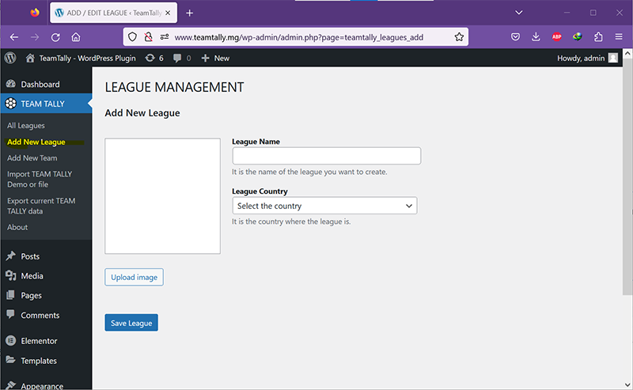


### 2.2. Displaying the leagues
After adding league data, you can view a list of all leagues by clicking on the "All Leagues" option in the left-hand menu of WordPress. From there, you can easily manage each league, including deleting or editing a league, and managing the teams associated with each league. This feature makes it easy to keep track of your teams and leagues, and to make changes as needed with just a few clicks.


### 2.3. Deleting a league
It is important to note that before deleting a league, you should ensure that there are no teams associated with it. To delete a league, simply display the league and then click on the "delete icon" located at the bottom of the league card. Once you click on the icon, you will be prompted to confirm your decision. This extra step helps to prevent accidental deletion and ensures that you can manage your data with confidence.


### 2.4. Editing a league
If you need to edit or modify a league, you can easily do so by first displaying the league card and then clicking on the "edit icon" located at the bottom of the card next to the "delete icon". This will bring up the same form used when creating a league, which will be pre-filled with information from the league you want to edit. Simply make the desired changes to the form and submit it to finalize your modifications. With this feature, it's easy to update your league information and ensure that your data is always accurate and up-to-date.


## 3. Team Management
### 3.1. Accessing the Team Management and display Teams
In order to perform any operation on your teams, it's important to first select the corresponding league. You can do this by clicking on the logo of the league you want to work with in the league card. This is necessary because each team must be associated with a league. Once you've selected a league, any available teams associated with that league will be displayed. All subsequent operations you perform will then be applied to that selected league, making it easy to manage your teams and keep everything organized.

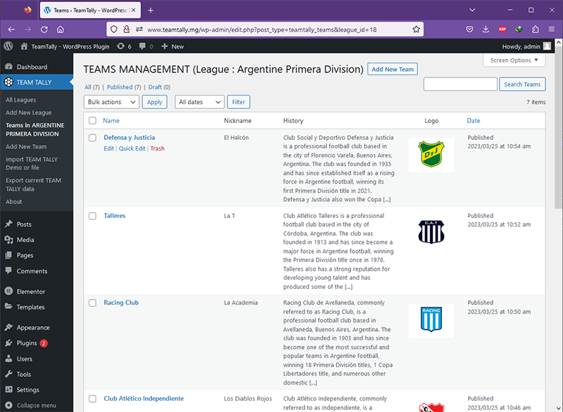

### 3.2. Creating a new team
There are several methods for adding a new team to a league. You can access the "Add New League" option in the left-hand menu, or click the "Add Menu" button located next to the "Teams Management" title at the top of the screen while viewing the list of teams. This will display a form where you can enter the team's name, nickname, history, logo, and select the league to which the team will be associated. After filling in the required fields, click the "Publish" button to save your changes.

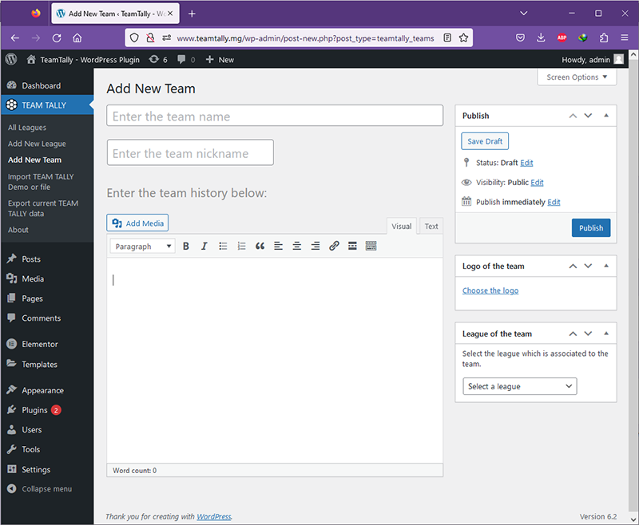

### 3.3. Editing an existing team
To edit a team, locate the team row in the teams list and click on the "Edit" link located underneath it. This action will take you to the same form used for creating a new league. You can then make the necessary changes to the team's information in the form, and save the modifications.


### 3.4. Deleting a team
To delete a team, simply click on the "Trash" link located under the team you want to delete in the displayed list.

## 4. League Elementor Widget
The League Elementor Widget is a powerful tool that allows users to easily display and customize various types of data related to leagues on their WordPress website. With this tool, users can create custom league pages. The widget also comes with pre-designed templates and styles that can be further customized from Elementor's interface.

### 4.1. Adding the League Elementor Widget to a page

To utilize the League Elementor Widget, you need to drag and drop it from the Elementor panel onto an existing or new page. After doing so, you can access the widget's various features, such as filtering by league or country, reordering, selecting an output template, or setting custom CSS.

Once the League Elementor Widget is added to a page, you will be prompted to select a template for displaying the list of leagues. This message appears because the plugin requires a template to correctly display the leagues. To select your desired template, simply click on the "Manage output template" section in the Elementor panel and choose the template you prefer. After that, you will be able to view the list of available leagues on the page.


### 4.2. Filtering by League
To filter the list of leagues displayed on the page, go to the "Filtering by League #ID" section in the Elementor Panel and check the "Activate" checkbox. Then enter the corresponding League #ID to display. You can find the League #ID for each league when displaying the list of leagues by looking for the "#" symbol followed by the number inside parenthesis, next to the league title. This number is also accompanied by the number of teams associated with that league.

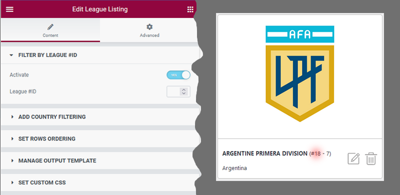

### 4.3. Filtering by country
To display only the leagues that belong to a particular country, you can use the filtering by country feature. To activate this feature, simply click on the "Add Country Filtering" section in the Elementor Panel and check the "Activate" checkbox. Next, you can choose the country that you want to filter by.


### 4.4. Ordering the displayed rows
To change the order of the displayed results in the League Elementor Widget, you can reorder them by "League Name" or "League Country". Additionally, you can choose whether to display them in "Ascending" or "Descending" order. Simply access the "Set Rows Ordering" section to select and adjust these options.


## 5.Team Elementor Widget
The Team Elementor Widget is designed to allow users to display a list of teams on the pages of their website. With this widget, users can add team details such as names, nicknames, logos, history, and customize the output with various templates and filters. The Team Elementor Widget also allows users to order teams by name or nickname.

### 5.1. Adding the Team Elementor Widget to a page
To utilize the Team Elementor Widget, drag it from the Elementor panel to a new or existing page. A message will appear, prompting you to select a template to display the list of teams. Choose a template from the "Manage Output Template" section, and all the teams in the database will be displayed. Configure the widget to refine the displayed data.

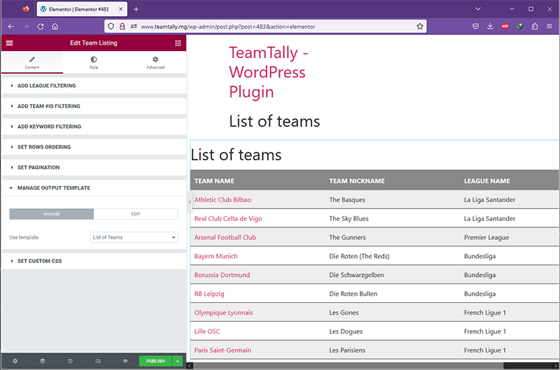

### 5.2. Filtering by League
To filter the teams list by league using the Team Elementor Widget, you need to access the "Add League Filtering" section in the Elementor panel and activate the corresponding checkbox. Then, you can choose a league from a combobox or enable the "Pick value from HTTP query first" option, which looks for the "league_id" HTTP query parameter in the current URL to filter the teams accordingly.

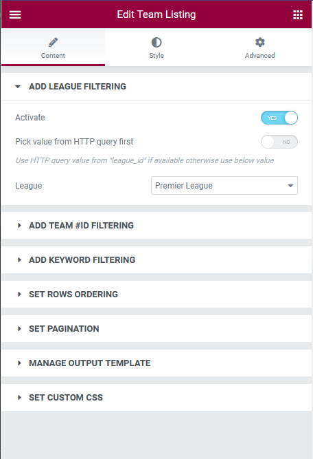

### 5.3. Filtering by Team #ID
To display only one specific team using the Team Elementor Widget, you can activate the Team #ID filtering in the appropriate section of the Elementor panel. Then, you can enter the corresponding Team #ID into the designated field.

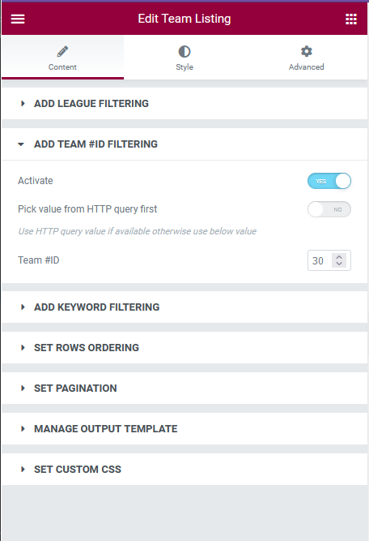

The Team #ID can be found in the teams listing from the Teams Management.


Alternatively, you can choose to get a dynamic Team #ID from the HTTP query parameter by enabling the "Pick value from HTTP query first" option.

### 5.4. Filtering by Keyword
To display teams containing a specific keyword, activate the "Add Keyword Filtering" feature in the corresponding Elementor panel section. Then, enter the keyword you want to filter the results with.


### 5.5. Ordering the displayed rows
To order the team listing results row, navigate to the "Set Rows Ordering" section in the corresponding Elementor panel. Here, you can select the sorting criteria from "Name" or "Nickname" and choose the ordering direction between "Ascending" or "Descending".


### 5.6. Setting pagination
The "Set Pagination" section in the Team Widget allows you to control the number of rows displayed on the page. You have the option to either display all rows or a limited number of rows. If you choose to display all rows, you can enable pagination to split the results into multiple pages. The "Rows per page for pagination" field determines the number of rows to display before the pagination is applied. The pagination feature uses AJAX, which means it doesn't require a full page reload, making it convenient to include multiple Team Widgets on a single page.

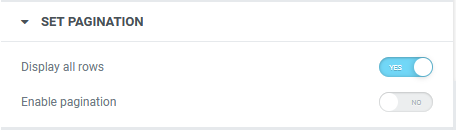

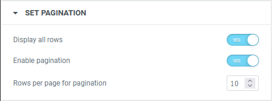


### 5.7. Setting Styles
To define the styling for odd or even row results in the Team Widget, you can use the "Style" tab in the panel. Choose the section for either odd or even rows depending on which one you want to style. From there, you can adjust the "Text Color", "Background Color" and "Typography" to set your preferred style.


## 6. Custom templates
The "Manage Output Template" section is available for both the League and Team Elementor Widget, and it enables users to fully customize the layout of each display result through custom templates.

### 6.1. Choosing a custom template
The League Widget and Teams Widget come with pre-defined templates to choose from. The League Widget's template is named "List of Leagues", which shows a card with a large logo, league title, and country. The Teams Widget has two pre-defined templates: "List of Teams", which displays results in a table with columns for team name, nickname, and league name, and "Team Details", which provides a detailed view of a single team and is ideal for showcasing more information.

From the "CHOOSE" tab, you have the option to select the template that you want to apply.

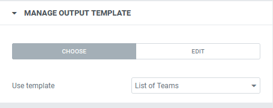

### 6.2. Editing a custom template
If you find that the pre-defined templates do not meet your needs, you can modify them and save them as new templates. To do so, select the template you wish to modify, then access the HTML template editor by clicking on the "EDIT" tab.

A template is composed of two parts:

- An "Item template," which contains the HTML code for a specific item (such as a league or a team).
- A "Container template," which contains the HTML code that groups all items together. The container includes a certain number of items.

Both parts of the template contain HTML code that you can modify. Within this HTML code, you can access some "Template Variables," which contain variable strings of data that must be included in the HTML code to generate the final HTML result.


There are two methods to incorporate the template variable into the HTML code. The first way is to use double braces to enclose the variable name: `{{variable_name}}`. In this case, the outcome will be escaped while displaying. The second method is to use triple braces to enclose the variable name: `{{{variable_name}}}`. This will result in the variable being displayed without any escaping.

#### 6.2.1. League Template Variables - Item Template

In the Item templates of the League Widget, there are several template variables that you can use, such as `league_id`, `league_name`, `league_country`, `league_logo_url`, and `class`. The `class` variable includes different CSS classes such as `first-item`, `last-item`, `only-item`, `odd`, and `even` that can help determine the status of the league item so that you can format it accordingly with CSS.

```
<!--
==============================
TEMPLATE VARIABLES:
==============================
  'league_id'
  'league_name'
  'league_country'
  'league_logo_url'
  'class'
==============================
-->
<div class="league-item {{{class}}}">
    <a href="{{{league_id}}}">
        <div class="league-logo" style="background-image: url({{{league_logo_url}}});"></div>
        <div class="league-info">
            <div class="league-name">{{{league_name}}}</div>
            <div class="league-country">{{{league_country}}}</div>
        </div>
    </a>
</div>
```


#### 6.2.2. League Template Variables - Container Template

In the Container Templates of the League Widget, the `content` template variable is utilized. This variable consists of a collection of generated league items via the Item Template. If we want to add some HTML code for formatting purposes, the Container Template is useful to wrap all of those items.

```
<!--
==============================
TEMPLATE VARIABLES:
==============================
'content'
==============================
-->
<div class="elementor-teamtally-leagues">
    {{{content}}}
</div>
```

#### 6.2.3. Team Template Variables - Item Template
As previously mentioned, the custom template for the Team Widget consists of an "Item Template" and a "Container Template". The Item Template includes the HTML code for the layout of each team and makes use of several template variables, including:

- `league_id`
- `team_id`
- `team_name`
- `team_nickname`
- `team_history`
- `team_logo_url`
- `league_name`
- `league_country`
- `league_logo_url`
- `class`

These variables are self-explanatory, so we will not go into further detail about them.

The `class` variable provides additional CSS information such as `first-item`, `last-item`, `only-item`, `odd`, and `even`, which can be used for formatting purposes.

> Setting the `class` template variable on an element of your item template is crucial if you want that specific element to be affected by the styles set from the STYLES tab of the Team Widget.

```
<div class="{{{class}}}"><a href="/team-detail/?team_id={{{team_id}}}">{{{team_name}}}</a></div>
<div class="{{{class}}}">{{{team_nickname}}}</div>
<div class="{{{class}}}">{{{league_name}}}</div>
```

#### 6.2.4. Team Template Variables - Container Template
The "Container template" of a custom template for the Team Widget serves as a wrapper for the HTML code generated from the conversion of all team query results into HTML. It makes use of several template variables:

- `title` : By default, this template variable contains the string "List of teams". However, if the displayed teams are filtered by league, `title` will change to "Teams from: " followed by the name of the league.
- `content` : This variable will contain the HTML code of all the processed team items, which were generated using the "Item template".
- `pagination` : If you plan to use pagination, this variable will generate the necessary HTML code.

```
<header class="page-header">
	<h1>{{{title}}}</h1>
</header>

<div class="elementor-teamtally-team__template__01">
  <div class="content">
    <div class="header">Team Name</div>
    <div class="header">Team NickName</div>
    <div class="header">League Name</div>
    {{{content}}}
  </div>
  <nav class="pagination">{{{pagination}}}</nav>
</div>
```

#### 6.2.5. Saving the modifications into a new template
First and foremost, it's crucial to understand that the pre-defined templates cannot be altered. Therefore, any changes made to a template should be saved under a different name than the pre-defined template's name. After making the desired modifications, you can save the template by clicking the "save" button. It's important to note that if you wish to use the new template on your page, you must select it from the "CHOOSE" tab.

### 6.3. Deleting a template
As previously mentioned, pre-defined templates cannot be modified or deleted, but only the templates created by the user. To delete a custom template, select it from the "CHOOSE" tab, then navigate to the "EDIT" tab and click on the "DELETE" button.

### 6.4. Custom CSS
The "STYLE" tab of the Widget Panel enables you to customize colors, background colors, and typography. However, for more advanced style customization through custom CSS, you can use the "Custom CSS" section. To set your custom CSS, simply enter your CSS code.


## 7. Export TEAM TALLY data
The TEAM TALLY plugin provides an option to export its data (including leagues, teams, and logos) as a ZIP file, which can be imported later. To use this feature, access the "Export current TEAM TALLY data" option from the left-hand menu and click on the "Proceed to export" button. The resulting ZIP file containing the backup will be stored in the "teamtally/exports/" subfolder of the WordPress upload folder. Once the export process is complete, you will receive a link to download the backup, if desired.


## 8. Import TEAM TALLY data
There are three import options available for restoring backups in TEAM TALLY:

1. **Import TEAM TALLY DEMO**, which was previously discussed in the documentation.
2. **Import data from an exported archive**, which allows you to restore a backup that was saved using the EXPORT DATA option. Backups are displayed in a combo box sorted by date and time.
3. **Import data from an uploaded file**, which can be used if the backup ZIP file was stored in a location other than the default TEAM TALLY exports folder in the WordPress uploads directory.

To use any of these options, simply select the desired option and click the "PROCEED TO IMPORT" button. Additionally, you can choose to activate the "Remove all previous TEAM TALLY data" checkbox before importing to replace all previous TEAM TALLY data with the backup.


## 9. Practical example of using the Elementor Widgets
In this practical exercise, our goal is to create a page that shows a list of all leagues.


When a user clicks on a league, a table will be displayed that shows all the teams from that league.


If the user clicks on a specific team in the table, the details of that team will be displayed.

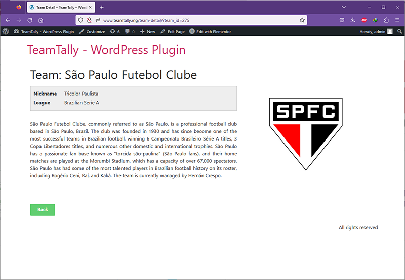

### 9.1. Creating the team full detail page
To achieve the exercise, we will create the pages in reverse order of how they were previously presented. This means we will start by creating the page that presents the team's complete details.

Initially, we will use elementor to design a new page and name it "Team Detail" in the page settings panel.

Then, we will proceed to configure each section of the team widget:

- *ADD LEAGUE FILTERING* : Since we only need to retrieve information for a single team, there is no need to configure this section extensively. Filtering by the team's #ID is sufficient.
- *ADD TEAM #ID FILTERING* : The team detail displayed depends on the user's selection from the list of teams. Thus, we cannot use a fixed team #ID for configuring the team widget. Instead, we will utilize a dynamic team #ID obtained from the HTTP query parameter. We will then configure this section according to the image below.

  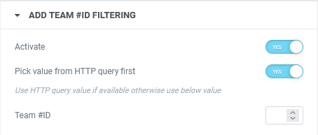

- *ADD KEYWORD FILTERING* : Since keyword filtering is unnecessary, this section will not require any configuration.
- *SET ROWS ORDERING* : Since only one team's information is required, there will be a limited number of query rows to display. Therefore, rows ordering is not necessary, and this section will not require any configuration.
- *SET PAGINATION* : Like before, since only one query row will be generated, pagination configuration is unnecessary.
- *MANAGE OUTPUT TEMPLATE* : We need to choose a suitable template to present the queried team. Fortunately, TEAM TALLY has a pre-existing template designed for displaying a team's complete details. We will utilize this template by selecting it from the "CHOOSE" section, where it is labeled "Team Detail."

  

- *SET CUSTOM CSS* : At present, we are satisfied with the default design, and thus no custom CSS configuration is necessary.

Now, we can proceed to save the page. Once saved, it can be accessed via the relative URL `/team-detail/` because of it's title. This URL will be crucial in our next step, where we will create a hyperlink to this page.

### 9.2. Creating the list of teams page for a league.
Our next step is to create a new page using Elementor that will display a list of teams belonging to a specific league. We will name this page "List of Teams" in the page settings panel so that it's relative URL become `/list-of-teams/`. This URL will be necessary for the next step when configuring the list of leagues.

After creating the page, we can configure each section of the Team Widget.

- *ADD LEAGUE FILTERING* : Our goal is to create a page that shows all teams associated with a particular league. However, the specific league displayed will depend on user selection, so we need to set up dynamic configuration for the `league_id` through HTTP query parameters. We can do this by configuring the league filtering section as shown in the image below. When previewing the page, you may see a message that says "No teams found", but don't worry. This is because the HTTP query parameter is not set during the page editing process.

  

- *ADD TEAM #ID FILTERING* : Since we want to display all queried rows, there is no need to filter the results by team #id. Therefore, we will not configure this section.
- *ADD KEYWORD FILTERING* : This section on keyword filtering is not necessary for our purpose, so we won't configure it.
- *SET ROWS ORDERING* : You have the option to choose the ordering of the results based on name or nickname and select the order direction. It is up to you to configure it according to your preference.
- *SET PAGINATION* : To display all teams without exception, we need to enable the option "display all rows" in the "Set Pagination" section. However, since some results may contain a large number of rows, we also need to enable pagination so that the results can be split into a smaller fixed number of rows per page. Please refer to the picture below for the configuration to use.

  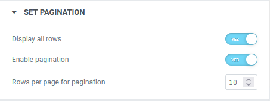

- *MANAGE OUTPUT TEMPLATE* : We will now select the "List of Teams" template through the "CHOOSE" tab in the "Manage Output Template" section. This template will present the teams in a table format with columns for "Team Name", "Team Nickname", and "League Name". The team name displayed in this template is linked by default to the URL `<a href="/team-detail/?team_id={{{team_id}}}">`. This URL will open the `/team-detail/` page that we created earlier and pass the corresponding `team_id` in the HTTP query parameter, ultimately displaying the complete details of the team.

  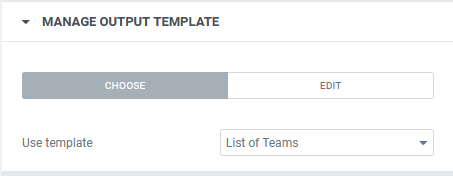


- *SET CUSTOM CSS* : We will not utilize this section since we do not require any further customization on styling.

### 9.3. Creating the list of league page

To build the list of leagues, we will create a new page using Elementor and name it "List of Leagues" via the "Page Settings Panel". We will then add the "League Listing" Widget to the page by dragging it from the Elementor Panel and dropping it into the Preview Page. We will configure it using the settings below.

- *FILTER BY LEAGUE ID* : No configuration is required for this section as there is no need for filtering by league ID.
- *ADD COUNTRY FILTERING* : As we don't require any country-based filtering for the results, we won't be configuring this section.
- *SET ROWS ORDERING* : You can choose your preferred rows ordering configuration in this section.
- *MANAGE OUTPUT TEMPLATE* : As usual, to view the results, a template needs to be selected. In this case, there is only one pre-defined template available for displaying the leagues, which will show all leagues as a card with a large logo at the top and the name and country at the bottom. This template also includes a link URL that will open the corresponding list of teams for the league. The default URL for the link is `<a href="/list-of-teams/?league_id={{{league_id}}}">`. If you need to modify this URL, you can create a new template to suit your specific requirements.

  

- *SET CUSTOM CSS* : No custom CSS configuration is required since we are satisfied with the pre-defined layout of the league listing.

That practical exercise aimed at building three interconnected pages through the utilization of Elementor and the TEAM TALLY plugin. The initial page presents a list of all available leagues, and a click on a particular league leads to the second page displaying all the teams belonging to that league. Lastly, selecting a team from the second page opens the final page, which displays a detailed view of the chosen team.

We had the opportunity to experiment with different configurations of the TEAM TALLY WordPress plugin. We explored options such as league filtering, team #ID filtering and their associated dynamic filtering. We also configured pagination and output templates, allowing us to customize the display of the data. Overall, the exercise provided a hands-on experience with the features of the plugin and demonstrated its flexibility and versatility.

## 10. Conclusion
Great! It seems that the documentation for the TEAM TALLY WordPress plugin is complete now.

We hope that this documentation has provided you with a clear understanding of the plugin's features and how to use them to create a list of teams and leagues. Please feel free to experiment with all the available options and configurations to make the best use of the plugin.

In conclusion, I wish you a great time exploring the TEAM TALLY plugin and have fun building your lists of teams and leagues. If you have any questions or feedback, please do not hesitate to reach out to me.
